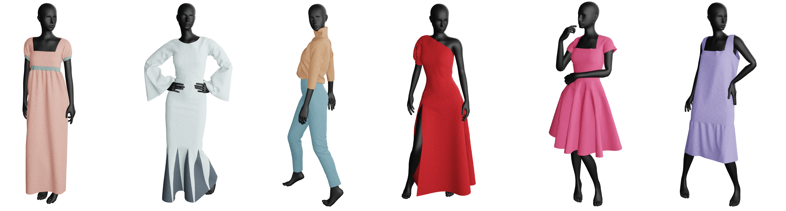

# GarmentCode: Programming Parametric Sewing Patterns



Implementation of GarmentCode architecture and garment programs.

## Documents

Provided in `./docs` folder

1. Installtion instructions: [Installation](docs/Installation.md)
2. How to run the configurator & adjust parameters: [Running](docs/Running.md)

## Navigation

### Library

[PyGarment](pypattern) is the core library described in GarmentCode paper. It containes the base types (Edge, Panel, Component, Interface, etc.), as well as edge factory and various helpers and operators that help you design sewing patterns.  

### Examples

* [assets/garment_programs/](assets/garment_programs/) contains the code of garment components designed using PyGarment. 
* [assets/design_params/](assets/design_params/), [assets/body_measurements/](assets/body_measurments/) contain examples of design and body measurements presets corresponding to the designs and retargeting results showcased in our GarmentCode paper. They can be used in both GarmentCode GUI and `test_garments.py` script.

> NOTE: [assets/design_params/default.yaml](assets/design_params/default.yaml) is the setup used by GUI on load. Changing this file results in changes in the GUI initial state =) 


## Citation

If you are using our system in your research, consider citing our paper.


```
@article{GarmentCode2023,
  author = {Korosteleva, Maria and Sorkine-Hornung, Olga},
  title = {GarmentCode: Programming Parametric Sewing Patterns},
  year = {2023},
  issue_date = {December 2023},
  publisher = {Association for Computing Machinery},
  address = {New York, NY, USA},
  volume = {42},
  number = {6},
  doi = {10.1145/3618351},
  journal = {ACM Transaction on Graphics},
  numpages = {16},
  keywords = {sewing patterns, garment modeling}
}
```

## Issues, questions, suggestions

Please, post your issues and questions to [GitHub Issues](https://github.com/maria-korosteleva/GarmentCode/issues).

For other requests you can find my info on https://korosteleva.com/.  


## Attribution & Body use disclaimer
We are using samples from [SMPL](https://smpl.is.tue.mpg.de/) body model as base for [Body Model examples](assets/Bodies). 

### Disclaimer
Due to the restrictiond of SMPL License we cannot share all 3D models of the body shapes used in our paper, except for the base average bodies for male and female versions of SMPL. We nontheless share the approximate body measurements a skinny and fluffy models to showcase the adaptation of the patterns to different body types. 
